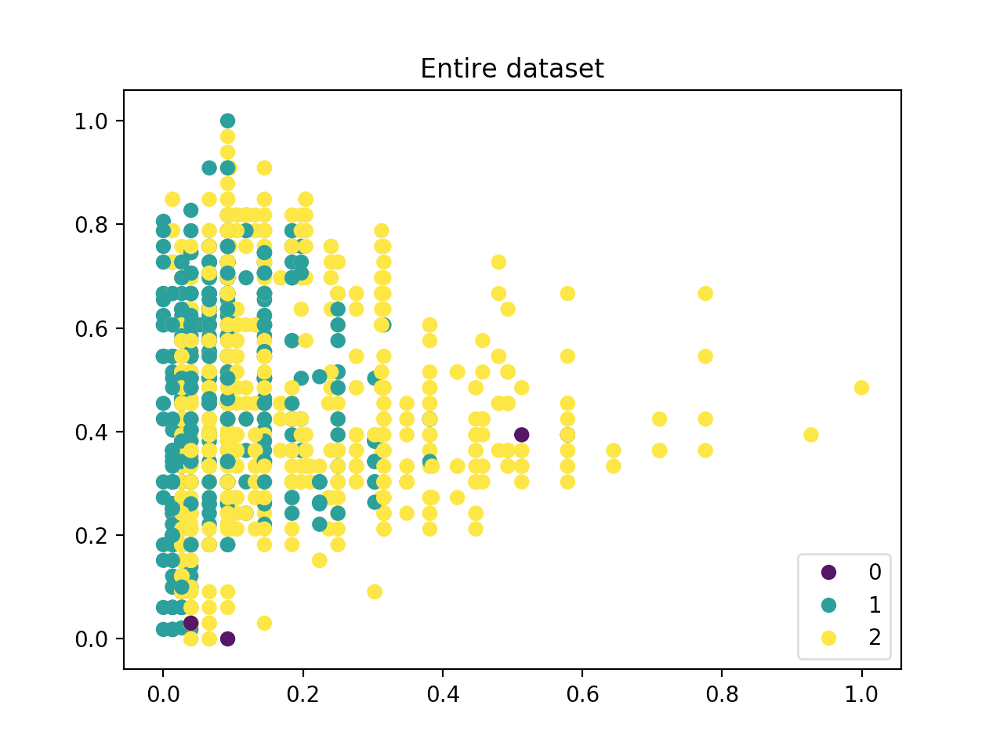

# k-Nearest Neighbours Implementation

This is my implementation of k-Nearest Neighbours without Python libraries (with the exception of some necessary libraries). 

:shipit:

The libraries used are as follows:
- [collections - specifically Counter](https://docs.python.org/3/library/collections.html#collections.Counter)
- [Matplotlib](https://matplotlib.org/)
- [Numpy](https://numpy.org/)
- [Pandas](https://pandas.pydata.org/)

---

The idea of creating this was to better understand how kNNs work, and the best way of doing so was to write it out from scratch, without any machine learning libraries. I was always comfortable with using machine learning libraries, but I realised that I did not have a complete understanding of all the calculations that were being made under the hood. Hence this is my effort to understand such calculations at a fundamental level.

If you are reading this and you are unsure of what k_Nearest Neighbour does, here's <a href="https://en.wikipedia.org/wiki/K-nearest_neighbors_algorithm">Wikipedia's</a> explanation.

Also, credits for the data source can be found at the bottom of this page.

## Overview

The example of the model was as follows:

1. Dataset used contained CPU specifications from Intel. Specifically the ones that were considered:

  - Number of cores
  - Cache Size
  - Base Speed
  - Status (whether the CPU was discontinued, already launched, or was announced)

2. Using the Cores, Cache Size and Base Speed, the model should predict the status of a CPU of such specifications.
3. Features were normalized to [0,1] and labels were encoded to integers (0 - Announced, 1 - Discontinued, 2- Launched).
4. Training and testing data was split at 80-20 (but can be tweaked by the user as an input).
5. k = 3 was set (can be changed via user input), distance matrix used was Euclidean distance (but can be changed to            Manhattan).

The model was run 5 times, and the <b>average test accuracy</b> recorded was <b>0.738983</b>. (The reason the accuracy does not stay the same is that the order of the data points were randomised on each run, hence randomising the points in the training and testing sets respectively.

---

This repo consists of four Python files and 2 folders.

- data_source folder -> CSV file of the dataset used
- screenshots folder -> images of (very basic) dataset distribution 
- intel_dataset.py -> formatting and normalizing features and labels to be used from the dataset
- kNN_output.py -> utilises my implementations from scratch to train a kNN model and produce an output
- kNN.py -> main file for kNN implementation
- preprocessing.py -> converts training/testing data into suitable arrays for the kNN model, splits dataset into training/testing groups & basic visualisation of training/testing data points

If you would like more information on each of the files, I have written some annotations on each of them. (ie. their input/output types, how libraries are used, reasons for manipulating data points etc.)

---
The image below shows the data distribution. It is clear that the 'Announced' process is severely underrepresented and can affect the accuracy of the predictions. One way to counter this is to completely remove data points of such status from the training and testing inputs. This may be viable if I am not interested in the status. Alternatively, the feature selection can be expanded to include more of such points from the dataset.

## Data Source

The data source can be found <a href="https://www.kaggle.com/ltcptgeneral/cpu-specifications/data">here</a>.

The dataset consists of CPU specifications of AMD and Intel CPUs scraped from their respective websites. All credit for the data and the data collation goes to the author.

